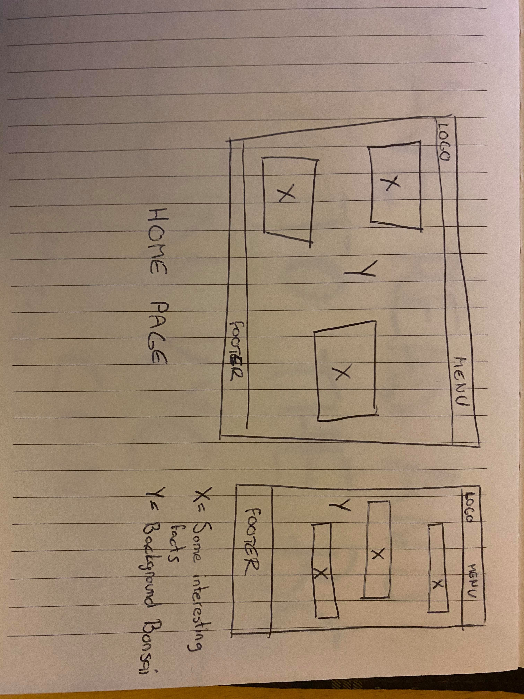
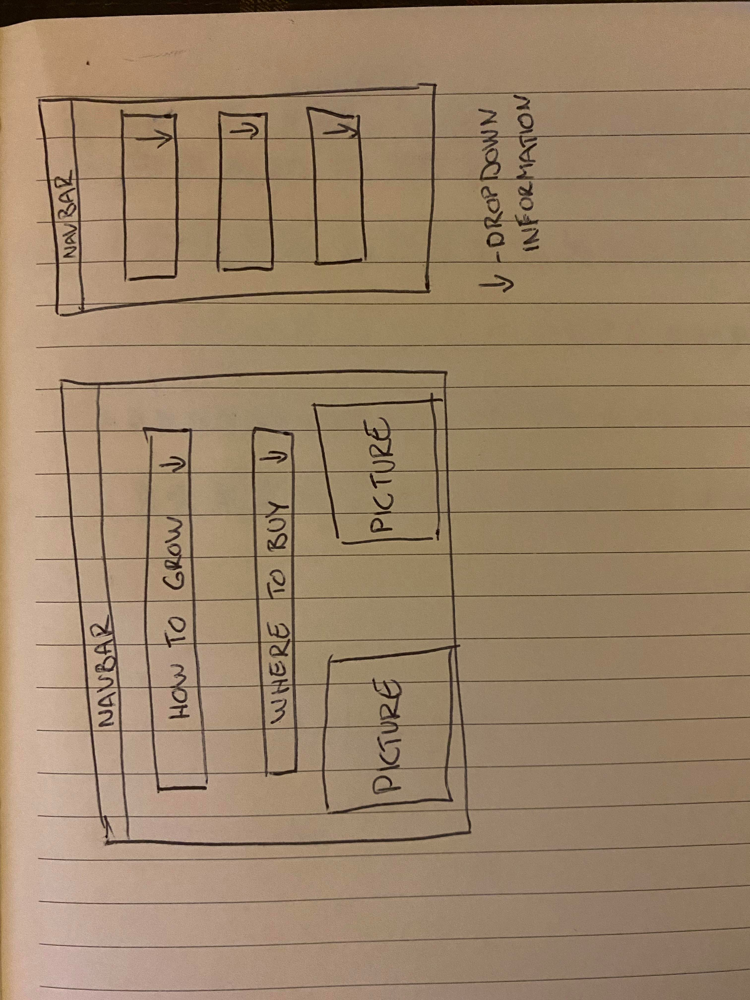
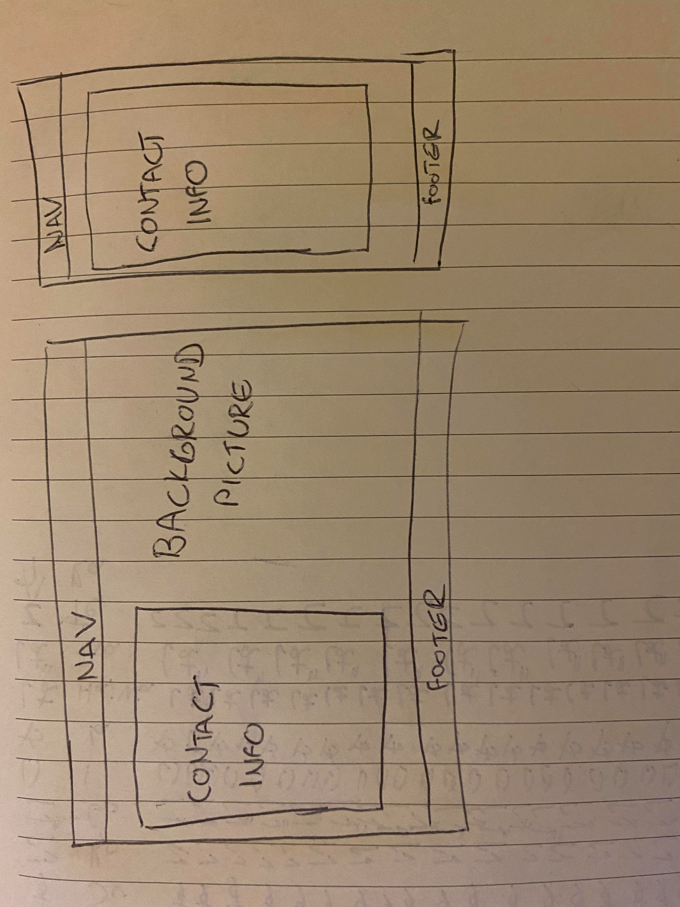

#  **BONSAI STARTING GUIDE WEBSITE** 

## **Introduction**

The goal of the project is to provide users some introduction to Bonsai art, including instructions of how to grow one from seed.

Landing Page offers some interesting facts. Link to YouTube shows us another interesting thing most do not know, as well as leading us to the other page with growing information in detail.

This is my first milestone project, providing easy navigation across multiple sites, simple esthetics, and basic information users look for.

[Live site - Bonsai](https://dinkokmonicek.github.io/Milestone-Project-1/)

## **Table of Content**

- [User Experiance](#user-experiance)

- [Wireframes](#wireframes)

- [Technologies Used](#technologies-used)

- [Testing](#testing)

- [Deployment](#deployment)

- [Future Features](#future-features)

- [Credits](#credits)

- [HTML Walkthrough](#html-walkthrough)

## **User Experiance**

- This website is for anyone looking for some beginner information about Bonsai trees.

- Home page provides minimum content, as well as some interestings facts.

- Grow page provides information about how to grow Bonsai tree from seed, and where to get them, locally in Dublin, and online on Amazon.

### User Stories

- "This page offers everything I need to know about growing Bonsai tree from seed."

- "I like Bonsai trees, even though I never had one, but when I saw this page I got one and it grew perfectly following the instructions on the page!"

- "I had some questions and worries about my Bonsai trees, and once I contacted John Doe, he helped me within 10 minutes!"

## **Wireframes**

## **Technologies Used**

- Languages
    -   [HTML5](https://en.wikipedia.org/wiki/HTML5)
    -   [CSS3](https://en.wikipedia.org/wiki/Cascading_Style_Sheets)  
            - CSS linked to a separate style.css file

- Other resources and tools
    -   [Google Fonts](https://fonts.google.com/)  
                - "Roboto", sans-serif;

    -   [Font Awesome](https://fontawesome.com/)  
                - Icon used in navbar-background

    -   [Bootstrap 5](https://getbootstrap.com/)  
                - Site is using bootstraps content delivery network  
                - Bootstraps navbar used across all sites  
                - Various tools used for containers, rows, and cols

    -   Various google images used for a project  
            - **THIS SITE IS ONLY A PROJECT, AND WILL NOT BE USED FOR ANY OTHER PURPOSE BESIDES CODE INSTITUTE MILESTONE PROJECT**

## **Testing**

- When navigating from homepage, all the menu items tested.
- When navigating from any other page then homepage, all the menu items tested, and we can click on the brand on the left, to take us back to homepage.
- All links across site, leading to outside our site, open in a new tab.

- Responsiveness
    - Site has been tested across all screen sizes
        - Google Chrome Developer Tools used for testing responsiveness
        - iPhone 11 used for testing responsivness
    - Responsiveness made manually with mediaQueries
    - When looking at the site with a device smaller then 992px (width)
        - Navbar items turn into a button, which collapsed menu items at the top of the screen.
        - Second section of the home page is displayed one below the other, they wouldn't be able to be seen one next to the other as they would have to be extremely narrow.
    - Site has been tested on [Google Mobile Frendly Test](https://search.google.com/test/mobile-friendly)
- Commits
    - After "Initial commit", there is "First commit", using "First commit" is not good practice, as it doesn't specify any information. "First commit" was used as a test while learning to deal with Git.

    - There has been an issue with commits regarding updating readme file. I started doing readme on GitHub instead of GitPod, realized for every time I want to save/test I have to commit, so when I changed my workspace back to Gitpod it was already too late because few commits have been done.
    

## **Deployment**

- Live site has been deployed on [GitHub Pages](https://dinkokmonicek.github.io/Milestone-Project-1/)
    - GitHub pages is a free service as long as we use it for projects only. 
    - If site is to be used, I would need proper domain.

## **Future Features**

- Social links in the footer dont lead to a specific place, if site is to go live and to be used, I would add exact links leading to pages users look for.
- Background pictures are to be smaller in size, for faster load times, if site is to go live and be used, pictures should be compressed to load faster on slower internet connections.
    - I do not own background pictures, so instead of compressing them, I would use other ones with appropriate copyrights.

## **Credits**

- [Bonsai Empire](https://www.bonsaiempire.com/)  
            - Various text sourced from here
- [Bonsai And Blooms](https://www.bonsai-and-blooms.com/growing-bonsai-from-seed.html)  
            - Growing information sourced from here  
            - This site referenced as a button below growing information
- Images found at google used on site  
            - **THIS SITE IS ONLY A PROJECT, AND WILL NOT BE USED FOR ANY OTHER PURPOSE BESIDES CODE INSTITUTE MILESTONE PROJECT**

## **Website Walkthrough for future developers**

### ***SHARED ACROSS ALL SITES***
- ##### NAVBAR
    - Created using bootstrap
    - Just one responsive change with navbar items being a collapse list when viewing on a screen < 992px

- ##### FOOTER
    - Two responsive columns made using bootstrap
    - When > 992px they become inline-blocks

### ***INDEX.html***

- Index has two sections, displayed one below the other
- All sections made using bootstraps row/cols

- ##### FIRST SECTION

    - Background classed bonsaiBackground
    - First impression background with some text displayed in upper and lower text blocks  
                text blocks classes - bonsaiContent and bonsaiContentSecond
            

- ##### SECOND SECTION

    - Some interesting info about theme of the site
    - Breakpoints at 992px, when < displayed as blocks, when > displayed as inline blocks
    - Background classed bonsai2Background
    - Two divs regarding content are classed bonsaiSection and definitionSection

### ***GROW.html***

- Information about growing your own bonsai.
- Made up of summaries and details for easier overview.

- Seeding information referenced from [Bonsai And Blooms](https://www.bonsai-and-blooms.com/growing-bonsai-from-seed.html)
    - Source link reference added on the bottom of the grow.html

### ***CONTACT.html***

- contactDiv with contact information placed inside contactBackground div
- contactDiv breakpoints made using css's media queries, editing only div's width on each breakpoint
